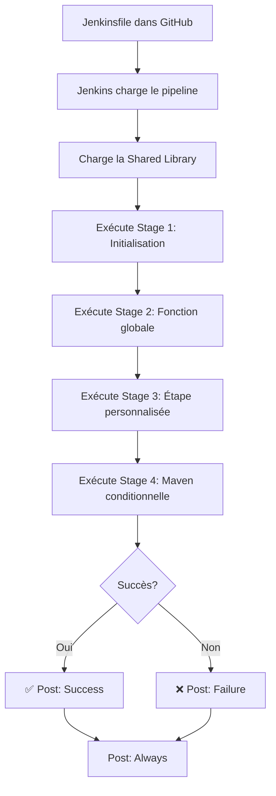

# 🎯 Jenkins Demo Project - Utilisation d'une Shared Library

[](https://www.jenkins.io/)
[](https://groovy-lang.org/)

> Projet réalisé dans le cadre du **TD3 - Démonstration d'utilisation d'une Shared Library Jenkins**  
> Par **Fieni Dannie Innocent Junior** - MCS 26.2 Cybersécurité & Cloud Computing  
> IPSSI Nice - 2025

---

## 📖 Description

Ce projet démontre l'**utilisation pratique** d'une Shared Library Jenkins dans un pipeline réel. Il illustre les différentes façons d'appeler et d'utiliser les fonctions et classes définies dans la bibliothèque partagée [`jenkins-shared-library`](https://github.com/JuFiSec/jenkins-shared-library).

---

## 🎯 Objectifs pédagogiques

- ✅ Utiliser une Shared Library dans un Jenkinsfile
- ✅ Importer et instancier des classes Groovy
- ✅ Appeler des fonctions globales directement
- ✅ Passer des closures (blocs de code) aux fonctions
- ✅ Gérer des paramètres et des valeurs de retour
- ✅ Comprendre le principe de réutilisation de code

---

## 🏗️ Structure du projet

```
jenkins-demo-project/
├── Jenkinsfile                  # Pipeline utilisant la Shared Library
└── README.md                    # Ce fichier
```

---

## 🔧 Prérequis

### Logiciels
- **Jenkins** (version LTS)
- **Plugin "Pipeline: Shared Groovy Libraries"**
- **Maven 3.9+** configuré dans Jenkins
- **Git**

### Configuration requise
1. La Shared Library `ma-lib-partagee` doit être configurée dans Jenkins
2. Repository de la bibliothèque : https://github.com/JuFiSec/jenkins-shared-library
3. Configuration : Manage Jenkins → System → Global Pipeline Libraries

---

## 📦 Installation et utilisation

### 1️⃣ Cloner le repository

```bash
git clone https://github.com/JuFiSec/jenkins-demo-project.git
cd jenkins-demo-project
```

### 2️⃣ Créer le job Jenkins

1. **Nouveau Pipeline**
   - Jenkins → New Item
   - Nom : `Demo-Shared-Library`
   - Type : Pipeline

2. **Configuration**
   - Definition : `Pipeline script from SCM`
   - SCM : `Git`
   - Repository URL : `https://github.com/JuFiSec/jenkins-demo-project.git`
   - Branch : `*/main`
   - Script Path : `Jenkinsfile`

3. **Lancer le build**
   - Cliquer sur "Build Now"

---

## 🔍 Analyse du Jenkinsfile

### Chargement de la bibliothèque

```groovy
@Library('ma-lib-partagee') _

import org.exemple.utils.MonUtilitaire
```

**Explication** :
- `@Library('ma-lib-partagee')` : Charge la Shared Library configurée dans Jenkins
- `_` : Convention Groovy pour l'import statique de tous les membres
- `import` : Importe la classe `MonUtilitaire` pour l'utiliser

---

### Stage 1 : Utilisation d'une classe

```groovy
stage('Initialisation') {
    steps {
        script {
            echo "=== Stage 1 : Initialisation ==="
            def utils = new MonUtilitaire(this)
            utils.saluer("Jenkins User")
            def resultat = utils.faireQuelqueChose()
            echo "Résultat: ${resultat}"
        }
    }
}
```

**Ce qui se passe** :
1. On crée une **instance** de la classe `MonUtilitaire`
2. On passe `this` pour donner accès au contexte du pipeline
3. On appelle la méthode `saluer()` → Affiche "Bonjour de la Shared Library, Jenkins User !"
4. On appelle `faireQuelqueChose()` → Retourne `true`

**💡 Concept clé** : Utilisation de classes pour de la logique complexe et orientée objet

---

### Stage 2 : Fonction globale simple

```groovy
stage('Utiliser une fonction globale') {
    steps {
        script {
            echo "=== Stage 2 : Test de fonction globale ==="
            def resultat = autreFonction("Ceci est un test de fonction globale.")
            echo "Résultat de autreFonction : ${resultat}"
        }
    }
}
```

**Ce qui se passe** :
1. On appelle **directement** `autreFonction()` (pas besoin d'import ni d'instanciation)
2. La fonction affiche le message passé en paramètre
3. Elle retourne `true`

**💡 Concept clé** : Les fonctions dans `vars/` sont accessibles globalement

---

### Stage 3 : Fonction avec closure

```groovy
stage('Utiliser une étape personnalisée') {
    steps {
        script {
            echo "=== Stage 3 : Étape personnalisée ==="
            monEtapePersonnalisee {
                echo "Ceci est le contenu du bloc passé à monEtapePersonnalisee."
                echo "On peut même appeler une fonction de la Shared Library ici :"
                def utils = new MonUtilitaire(this)
                utils.saluer("De l'intérieur de l'étape personnalisée")
            }
        }
    }
}
```

**Ce qui se passe** :
1. `monEtapePersonnalisee` prend un **bloc de code** (closure) en paramètre
2. La fonction exécute le code du bloc entre "Début" et "Fin"
3. Le bloc peut appeler d'autres fonctions de la bibliothèque

**Sortie console** :
```
Début de l'étape personnalisée
Ceci est le contenu du bloc passé à monEtapePersonnalisee.
On peut même appeler une fonction de la Shared Library ici :
Bonjour de la Shared Library, De l'intérieur de l'étape personnalisée
Fin de l'étape personnalisée
```

**💡 Concept clé** : Les closures permettent de créer des wrappers réutilisables

---

### Stage 4 : Fonction Maven conditionnelle

```groovy
stage('Démonstration avec Maven') {
    steps {
        script {
            echo "=== Stage 4 : Test avec Maven (si pom.xml existe) ==="
            if (fileExists('pom.xml')) {
                echo "Fichier pom.xml détecté, compilation avec Maven..."
                buildMaven(goals: 'clean compile')
            } else {
                echo "Pas de pom.xml trouvé, cette étape est ignorée."
            }
        }
    }
}
```

**Ce qui se passe** :
1. `fileExists('pom.xml')` vérifie si un fichier Maven existe
2. Si oui : appelle `buildMaven()` avec des paramètres personnalisés
3. Si non : affiche un message et continue

**💡 Concept clé** : Rendre le pipeline flexible et réutilisable

---

### Bloc post : Gestion des résultats

```groovy
post {
    success {
        echo '✅ Pipeline terminé avec SUCCÈS !'
    }
    failure {
        echo '❌ Pipeline terminé en ÉCHEC.'
    }
    always {
        echo '🔚 Nettoyage terminé.'
    }
}
```

**Ce qui se passe** :
- `success` : Exécuté si tout réussit
- `failure` : Exécuté si une étape échoue
- `always` : Toujours exécuté (cleanup, notifications, etc.)

---

## 📊 Résultats attendus

### Console Output

```
Loading library ma-lib-partagee@main
 > git rev-parse --resolve-git-dir /var/jenkins_home/...
...
[Pipeline] Start of Pipeline
[Pipeline] node
...

=== Stage 1 : Initialisation ===
Bonjour de la Shared Library, Jenkins User !
Opération réussie !
Résultat: true

=== Stage 2 : Test de fonction globale ===
Message depuis autreFonction : Ceci est un test de fonction globale.
Résultat de autreFonction : true

=== Stage 3 : Étape personnalisée ===
Début de l'étape personnalisée
Ceci est le contenu du bloc passé à monEtapePersonnalisee.
On peut même appeler une fonction de la Shared Library ici :
Bonjour de la Shared Library, De l'intérieur de l'étape personnalisée
Fin de l'étape personnalisée

=== Stage 4 : Test avec Maven (si pom.xml existe) ===
Pas de pom.xml trouvé, cette étape est ignorée.

✅ Pipeline terminé avec SUCCÈS !
🔚 Nettoyage terminé.

Finished: SUCCESS
```

---

## 🎓 Concepts clés démontrés

### 1. Chargement de bibliothèque
```groovy
@Library('ma-lib-partagee') _
```
→ Charge automatiquement la bibliothèque depuis GitHub

### 2. Import de classes
```groovy
import org.exemple.utils.MonUtilitaire
```
→ Rend la classe disponible dans le script

### 3. Instanciation
```groovy
def utils = new MonUtilitaire(this)
```
→ Crée une instance avec le contexte du pipeline

### 4. Fonctions globales
```groovy
autreFonction("message")
```
→ Appel direct sans import

### 5. Closures
```groovy
monEtapePersonnalisee {
    // Code du bloc
}
```
→ Passage de blocs de code comme paramètres

### 6. Paramètres nommés (Map)
```groovy
buildMaven(goals: 'clean compile')
```
→ Passage de configuration flexible

---

## 🔄 Workflow complet



---

## 🎯 Avantages de cette approche

### ✅ Réutilisabilité
- Les fonctions de la bibliothèque sont disponibles pour **tous les pipelines**
- Pas de copier-coller de code

### ✅ Maintenabilité
- Modification centralisée dans la Shared Library
- Tous les pipelines bénéficient automatiquement des mises à jour

### ✅ Standardisation
- Tous les projets utilisent les mêmes patterns
- Cohérence entre les équipes

### ✅ Simplicité
- Jenkinsfile plus court et lisible
- Logique complexe cachée dans la bibliothèque

### ✅ Testabilité
- Code de la bibliothèque testé indépendamment
- Qualité garantie

---

## 🛠️ Personnalisation

### Ajouter un nouveau stage utilisant la bibliothèque

```groovy
stage('Mon nouveau stage') {
    steps {
        script {
            def utils = new MonUtilitaire(this)
            utils.saluer("Mon Projet")
            
            monEtapePersonnalisee {
                echo "Ma logique métier ici"
            }
        }
    }
}
```

### Utiliser une version spécifique de la bibliothèque

```groovy
@Library('ma-lib-partagee@v1.0') _
```

---

## 📈 Évolutions possibles

- [ ] Ajouter un projet Maven réel pour tester `buildMaven()`
- [ ] Intégrer des tests unitaires
- [ ] Ajouter des stages de déploiement
- [ ] Utiliser plus de fonctions de la bibliothèque
- [ ] Créer des notifications avec Slack
- [ ] Gérer des secrets avec HashiCorp Vault

---

## 🔗 Liens connexes

- [jenkins-shared-library](https://github.com/JuFiSec/jenkins-shared-library) - La bibliothèque partagée utilisée
- [demo-jenkins-pipeline](https://github.com/JuFiSec/demo-jenkins-pipeline) - Projet Maven avec Jenkins

---

## 🛠️ Dépannage

### Problème : "Library not found"
**Solution** : Vérifiez la configuration dans Jenkins
1. Manage Jenkins → System → Global Pipeline Libraries
2. Vérifiez le nom : `ma-lib-partagee`
3. Vérifiez l'URL du repository

### Problème : "Class not found: MonUtilitaire"
**Solution** : Vérifiez l'import
```groovy
import org.exemple.utils.MonUtilitaire
```

### Problème : "Function not found: autreFonction"
**Solution** : Vérifiez que la bibliothèque est bien chargée
```groovy
@Library('ma-lib-partagee') _
```

---

## 📝 Licence

Ce projet est réalisé à des fins pédagogiques dans le cadre de la formation MCS 26.2 à IPSSI Nice.

---

## 👤 Auteur

**Fieni Dannie Innocent Junior**  
MCS 26.2 - Cybersécurité & Cloud Computing  
IPSSI Nice - 2025

[](https://github.com/JuFiSec)

---

## 🙏 Remerciements

- IPSSI Nice pour la formation
- La communauté Jenkins
- Les contributeurs des projets open source

---

**Date de création** : Octobre 2025  
**Dernière mise à jour** : Octobre 2025